# Hi, I'm Arnold

I'm a Discord developer building bots, integrations and small tooling. I work mainly with JavaScript and Node.js, I know some Python, and I do a bit of web development.

---

## About

<table>
<tr>
<td valign="top" width="55%">

- Currently: building Discord bots and automation tools using Node.js.
- Learning: deeper TypeScript patterns and async system design.
- Open to: collaboration on bots, API integrations, and small backend utilities.

</td>
<td valign="top" width="45%">

</td>
</tr>
</table>

## Contributions

## Contact

- Email: yousseftsaz@gmail.com
- Discord: #k77y
- Portfolio / Links: Soon...
